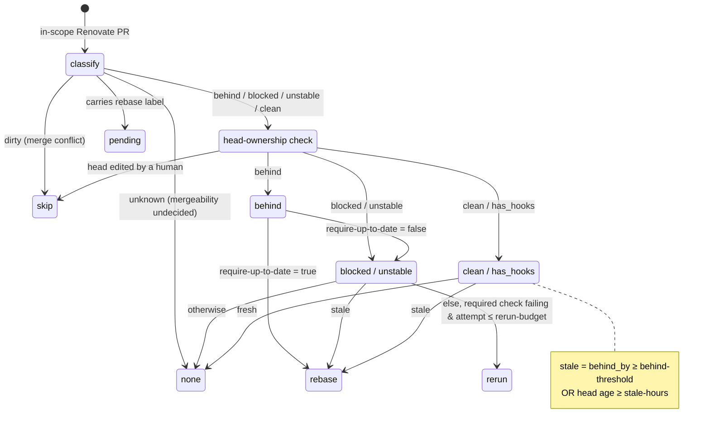

# Renovate PR maintainer

Keeps open [Renovate](https://docs.renovatebot.com/) PRs fresh and unstuck on repositories using `rebaseWhen: "conflicted"` by taking the **minimum** action per PR — rebase stale PRs (via the Renovate `rebase` label) or re-run failed required jobs (within a budget). On `rebaseWhen: "conflicted"`, PRs silently drift behind base until their checks rot, yet eager rebasing triggers a CI-burning rebase storm — this nudges only the PRs that are actually stale or stuck. Background: [camunda/team-infrastructure#1053](https://github.com/camunda/team-infrastructure/issues/1053).

## Usage

Run it on a schedule so it periodically nudges open Renovate PRs. With the defaults it only **rebases stale PRs** (reruns are off until you set a `rerun-budget`):

```yaml
name: Renovate PR maintainer

on:
  schedule:
    - cron: "0 */4 * * *" # every 4 hours
  workflow_dispatch: {}

permissions:
  contents: read
  checks: read
  actions: write
  pull-requests: write

jobs:
  maintain:
    runs-on: ubuntu-latest
    steps:
      - uses: camunda/infra-global-github-actions/renovate-pr-maintainer@main
        with:
          github-token: ${{ secrets.GITHUB_TOKEN }}
```

### Common tweaks

Try it safely first — classify and log only, change nothing:

```yaml
        with:
          github-token: ${{ secrets.GITHUB_TOKEN }}
          dry-run: true
```

Also re-run failed required checks (up to 2 attempts per commit):

```yaml
        with:
          github-token: ${{ secrets.GITHUB_TOKEN }}
          rerun-budget: 2
```

## What it does

A few common situations and the action it takes (with the defaults: rebase once a PR is ≥ 60 commits behind base **or** its head is > 24h old):

| Renovate PR situation | What the maintainer does |
|:----------------------|:-------------------------|
| 70 commits behind base, or head 30h old | Adds the `rebase` label → Renovate rebases it (fresh SHA) |
| Green and fresh (few commits behind, recent head) | Nothing — leaves it alone |
| Has a merge conflict | Nothing — Renovate rebases conflicts itself |
| Failing required check, fresh head¹ | Re-runs the failed jobs in place (no new SHA) |
| Already carries the `rebase` label | Nothing — a rebase is already queued |
| Branch has human-pushed commits | Nothing — leaves it for the human |

¹ Only when `rerun-budget` ≥ 1 (reruns are off by default).

See the [decision model](#decision-model) below for the exact rules.

## Decision model



- **rebase** — add the Renovate `rebase` label; Renovate does the real rebase (regenerates lockfiles, pushes a fresh SHA). This action never pushes commits.
- **rerun** — re-run the failed required workflow run(s) in place, no new SHA; budget derives from `run_attempt`.
- **no action** — the PR is left untouched this run; three states share that outcome but differ by reason and what comes next:
  - **`skip`** — merge conflict (Renovate rebases it itself) or a human-edited head (a rebase would discard manual commits); stays skipped until that changes.
  - **`pending`** — already carries the `rebase` label, so a rebase is queued; clears once Renovate acts on it.
  - **`none`** — fresh & green, or mergeability not yet known; re-evaluated next run.

## Inputs

| Input | Default | Description |
|:------|:--------|:------------|
| `github-token` | — (required) | Token with `pull-requests: write`, `actions: write`, `checks: read`, `contents: read`. Labeling a PR via the Issues Labels API is authorized by the `pull-requests` scope, not `issues`. |
| `repository` | `${{ github.repository }}` | Target repository (`owner/name`). |
| `exclude-labels` | `keep-updated,stop-updating` | Comma-separated labels that take a PR out of scope. |
| `behind-threshold` | `60` | Rebase when at least this many commits behind base (`B`). |
| `stale-hours` | `24` | Rebase when the PR head is at least this many hours old (`C`). |
| `rerun-budget` | `0` | Max workflow-run attempts per head SHA before reruns stop (`N`). `0` (default) disables reruns; set to `1`+ to enable. |
| `batch-size` | `10` | Max PRs acted on per run (blast-radius cap). |
| `base-branch` | `""` | Optional exact base-branch filter; empty means all. |
| `extra-trusted-logins` | `""` | Comma- or newline-separated extra logins (author/committer) treated as Renovate-owned, so trusted bots like `github-actions[bot]` don't mark a branch as human-edited. |
| `extra-rerun-checks` | `""` | Comma- or newline-separated check-run names to also treat as required for the rerun decision (unioned with ruleset-discovered checks). Use to retry a non-required/flaky check or one enforced via classic branch protection. |
| `require-up-to-date` | `false` | Treat the `behind` state ("require branches up to date") as a merge blocker and rebase immediately. When `false`, that signal is ignored and behind PRs are decided by staleness. |
| `dry-run` | `false` | When true, classify and log only; never modify any PR. |
