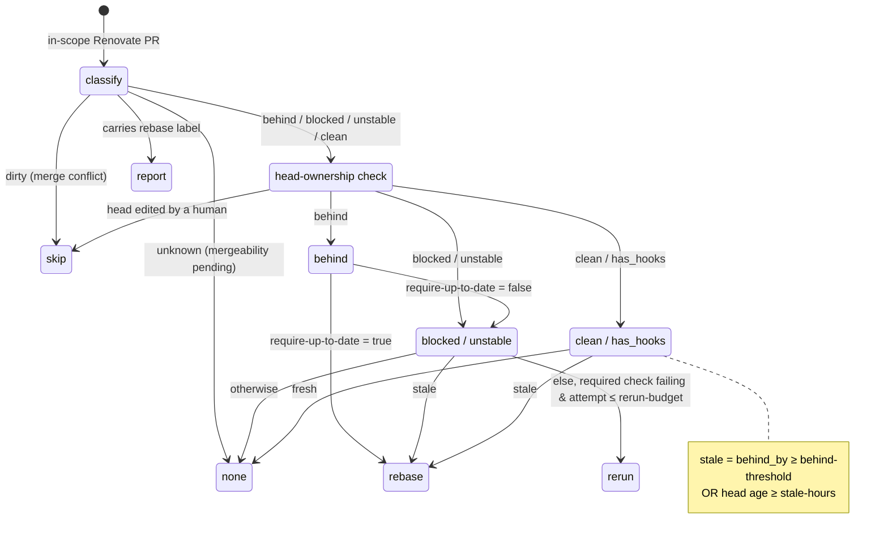

# Renovate PR maintainer

Keeps open [Renovate](https://docs.renovatebot.com/) PRs fresh and unstuck on repositories using `rebaseWhen: "conflicted"` by taking the **minimum** action per PR — rebase stale PRs (via the Renovate `rebase` label) or re-run failed required jobs (within a budget). Background: [camunda/team-infrastructure#1053](https://github.com/camunda/team-infrastructure/issues/1053).

## Decision model

- **rebase** — add the Renovate `rebase` label; Renovate does the real rebase (regenerates lockfiles, pushes a fresh SHA). This action never pushes commits.
- **rerun** — re-run the failed required workflow run(s) in place, no new SHA; budget derives from `run_attempt`.
- **skip · report · none** — no mutation (left for Renovate, a human, or the next run).

## Inputs

| Input | Default | Description |
|:------|:--------|:------------|
| `github-token` | — (required) | Token with `pull-requests: write`, `actions: write`, `checks: read`, `contents: read`. Labeling a PR via the Issues Labels API is authorized by the `pull-requests` scope, not `issues`. |
| `repository` | `${{ github.repository }}` | Target repository (`owner/name`). |
| `exclude-labels` | `keep-updated,stop-updating` | Comma-separated labels that take a PR out of scope. |
| `behind-threshold` | `60` | Rebase when at least this many commits behind base (`B`). |
| `stale-hours` | `24` | Rebase when the PR head is at least this many hours old (`C`). |
| `rerun-budget` | `0` | Max workflow-run attempts per head SHA before reruns stop (`N`). `0` (default) disables reruns; set to `1`+ to enable. |
| `batch-size` | `10` | Max PRs acted on per run (blast-radius cap). |
| `base-branch` | `""` | Optional exact base-branch filter; empty means all. |
| `extra-trusted-logins` | `""` | Comma- or newline-separated extra logins (author/committer) treated as Renovate-owned, so trusted bots like `github-actions[bot]` don't mark a branch as human-edited. |
| `extra-rerun-checks` | `""` | Comma- or newline-separated check-run names to also treat as required for the rerun decision (unioned with ruleset-discovered checks). Use to retry a non-required/flaky check or one enforced via classic branch protection. |
| `require-up-to-date` | `false` | Treat the `behind` state ("require branches up to date") as a merge blocker and rebase immediately. When `false`, that signal is ignored and behind PRs are decided by staleness. |
| `dry-run` | `false` | When true, classify and log only; never modify any PR. |
